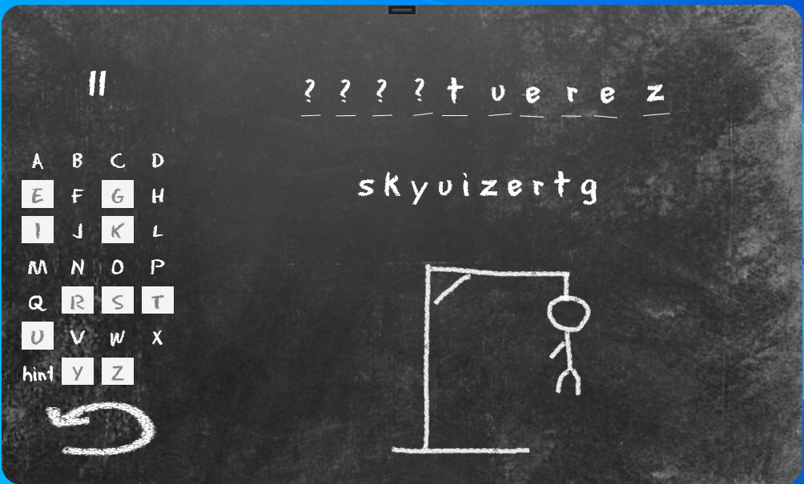

# nTrehou_Pendu - Le Jeu du Pendu

## 🎮 À propos
Développez un jeu du pendu en laissant libre cours à votre imagination. Ce projet propose plusieurs versions du jeu, chacune avec ses propres améliorations et caractéristiques.

## 📖 Instructions pour jouer

### HANGMAN V1
1. Jouez individuellement ou en groupe.
2. Sélectionnez une lettre de l'alphabet.
3. Si la lettre est dans le mot/phrase, prenez un autre tour pour deviner une lettre.
4. Si la lettre n'est pas dans le mot/phrase, cliquez sur le bouton "Essayer à nouveau" pour ajouter une partie du pendu.
5. Le jeu continue jusqu'à ce que:
   - Le mot/phrase soit deviné – GAGNANT
   - Toutes les parties du pendu soient affichées – PERDANT

### HANGMAN V2
- Ajout de design.

### HANGMAN V3
- Création du HANGMAN avec une classe.

### HANGMAN V4
- Mise de tous les mots dans un fichier txt et sélection aléatoire d'un mot.

### HANGMAN V5
- Ajout d'un chronomètre. Le joueur perd si le temps s'écoule ou gagne en voyant le temps utilisé.

## 📸 Captures d'écran
### Hangman V1

### Hangman V2

---

👨‍💻 Développé avec passion par Nicolas Trehou
